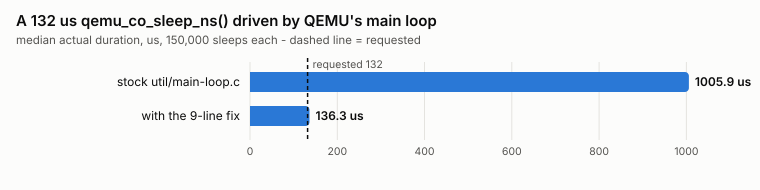
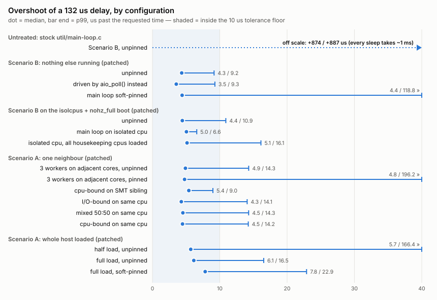
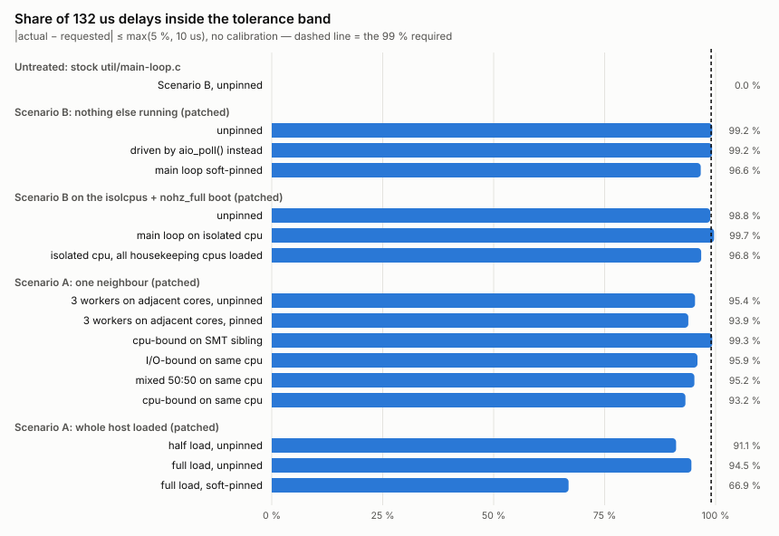

# Real-time delay injection in eVSSIM — spike summary (standalone benchmark)

**Date:** 2026-09-24 · **Host:** AMD Ryzen 7 7800X3D (8 cores / 16 threads, 1 socket), Linux 7.0.0-31, live desktop

Every number below comes from **`harness/qemu_mainloop_demo.c`**: a standalone program that links
QEMU 2.12's own `libqemuutil.a`, runs coroutines on QEMU's real main loop and calls
`qemu_co_sleep_ns()` exactly as eVSSIM's I/O path does — no guest, no reboot, reproducible in CI
(`infra/builder/run-ci.sh` runs the §4 matrix and the §5 mechanism sweep, minus the spin and isolated-cpu rows). 17 configurations × 300,000 sleeps = **5.1 M sleeps**, three of them on an
`isolcpus` + `nohz_full` boot, plus a sleep-mechanism sweep of 19 runs / **9.5 M sleeps** (§5). Tolerance band: `|actual − requested| ≤ max(5 %, 10 us)`,
required on **99 %** of samples.

---

## 1. Bottom line

| | |
|---|---|
| **Does QEMU's ns-delay routine work?** | The routine (`qemu_co_sleep_ns`, wall-clock) yes; **the way eVSSIM reaches it, no.** QEMU 2.12's main loop rounds every AioContext deadline up to a whole millisecond: a **132 us sleep takes 1006 us**. |
| **Fix** | 9 lines in `qemu/util/main-loop.c` → the same sleep takes **136 us** (+4.3 us p50, +9.2 us p99). |
| **Tolerance** | With the fix and nothing else running: **99.2 % in band** at 132 us, 99.95 % at 982 us. A 3–4 us calibration lifts reads to 99.7 %. |
| **Isolation decision** | **None — leave QEMU unpinned.** Soft affinity leaves the median alone and makes the tail 30–800× worse. Hard isolation gives the tightest distribution measured (p99 +6.6 us, worst case 51 us, 99.7 % in band) — but unpinned on a quiet host is already at 99.2 %, and the cost is a reboot and 6 of 16 cpus. |
| **Sleep mechanism** | **Hybrid — decided:** `qemu_co_sleep_ns()` to `target − 20 us`, then busy-spin to the target inside the coroutine. Mean overshoot **0.3–1.0 us** against co_sleep's 4.5–9.6 us, no calibration needed, wall time exactly the ideal with 3 or 16 coroutines in flight. Cost: main-loop cpu of `slack / delay` per sleep in flight (17 % at 3 coroutines, 40 % at 16, for 132 us delays). Pure spin is rejected: it serialises the coroutines (×18 to ×128 the ideal runtime). |
| **Main threat to accuracy** | **Host load, not a neighbour.** A half-loaded host has the worst tail (2.5 k sleeps > 50 us late, p99.9 2.6 ms); a fully loaded one shifts the median to +6 us. A single neighbour on the same cpu costs nothing at the median and 4–6 points in band. |

---

## 2. Method

- **Program:** `harness/qemu_mainloop_demo.c` — `qemu_init_main_loop()`, then 3 coroutines on the
  main AioContext, each calling `qemu_co_sleep_ns(QEMU_CLOCK_REALTIME, req)` **50,000 times** per
  delay while timing each call with `get_clock()`. Delays: **132 us** (eVSSIM page read:
  `REG_READ 82 + CELL_READ 50`) and **982 us** (page write: `REG_WRITE 82 + CELL_PROGRAM 900`).
- **Two builds** (`scripts/build_demo.sh`): *stock* links `util/main-loop.c` as in the qemu tree;
  *patched* links it with `scripts/qemu_main_loop_ns_deadline.patch` applied. Both link the same
  `libqemuutil.a`, so the result does not depend on how the tree was built.
- **Two drivers:** `--driver main_loop` = `main_loop_wait()`, QEMU's real loop, the path eVSSIM
  uses; `--driver aio_poll` = `aio_poll()` directly, the path the spike's first harness used.
- **Placement and noise** (`scripts/run_demo_matrix.sh`): the main-loop thread is pinned with
  `--pin-cpu 1` (SMT sibling: cpu 9) where stated; host noise comes from the spike's workers
  (`workers/`: cpu-bound, I/O-bound, mixed 50:50), pinned as the brief's scenarios specify;
  `SCHED_FIFO` is applied with `chrt -f 1` from the privileged builder container.
- **Mechanisms** (`--mechanism`, §5): `co_sleep` = `qemu_co_sleep_ns()` for the whole delay; `hybrid` =
  `co_sleep` to `target − slack` then a busy-spin on `get_clock()` inside the coroutine (`--slack-us`,
  default 20); `spin` = busy-spin the whole delay. The demo reports wall time per delay group against the
  ideal (`50,000 × req`) and the main-loop thread's cpu share (`scripts/run_demo_mechanisms.sh`).
- **Output:** one CSV row per sleep in the spike's raw format, summarised by `scripts/demo_report.py`
  and checked by `scripts/check_tolerance.py`. Result folders are generated and not committed
  (`results_*/` is git-ignored); the tables below are the record.
- The earlier **guest-based** runs (a booted VM driving fio through eVSSIM) found the same bug and fix; the tickets in §7 still cite them for the facts only a guest can
  show (object-mode stalls, vCPU starvation).

---

## 3. The millisecond trap and the fix

Nothing else running, unpinned, 150,000 sleeps per row:

| `util/main-loop.c` | driver | requested | actual p50 | overshoot p50 / p99 / p99.9 | in band |
|---|---|---:|---:|---:|---:|
| **stock** | `main_loop` | 132 us | **1005.9 us** | +873.9 / +887.2 / +893.7 us | **0.00 %** |
| stock | `main_loop` | 982 us | 1005.8 us | +23.8 / +34.2 / +43.1 us | 99.96 % |
| **patched** | `main_loop` | 132 us | **136.3 us** | +4.3 / +9.2 / +20.1 us | **99.24 %** |
| patched | `main_loop` | 982 us | 987.9 us | +5.9 / +16.5 / +28.9 us | 99.95 % |



**Cause:** the main loop reaches AioContext timers only through a glib source, and
`aio_ctx_prepare()` converts the deadline with `qemu_timeout_ns_to_ms()` = `DIV_ROUND_UP(ns, 1 ms)`
(`qemu/util/async.c:227`). Every sleep under 1 ms becomes exactly 1 ms. Writes hide it because
982 us ≈ 1 ms — which is why a write-only acceptance test passes. `aio_poll()` uses `ppoll()` at
nanosecond resolution and never sees it, which is why the first standalone harness did not either.

**Fix:** fold the AioContext deadline, at nanosecond precision, into the timeout `main_loop_wait()`
already gives `ppoll()`. Patched `main_loop` is then within 1 us of `aio_poll`.

**The remaining ~4 us** is a constant bias — the host kernel's `ppoll()` wake-up plus ~1 us of
QEMU dispatch (measured inside a guest with probes in `main_loop_wait()`; the guest's own share was
0.03 us). It calibrates out: requesting **3 us less → 99.65 %** in band with 0.1 % early wake-ups;
4 us less → 99.75 % with 2.5 % early. The three coroutines agree to 0.01 us at p50 and 0.3 us at p99.

---

## 4. Scenario A vs Scenario B

132 us sleeps, patched build, `main_loop` driver, 150,000 per row; overshoot in us. Pinned rows put
the main-loop thread on cpu 1 (SMT sibling: cpu 9). Same-cpu sharing and SMT-sibling contention are
separate conditions. The full table for both delays is what `scripts/demo_report.py` prints for a
`run_demo_matrix.sh` results folder.
¹ `isolcpus=domain,managed_irq,1-3,9-11 nohz_full=1-3,9-11 rcu_nocbs=1-3,9-11 irqaffinity=0,4-8,12-15`.

| scenario | configuration | overshoot p50 / p99 | p99.9 | > 50 us late | max | in band |
|---|---|---:|---:|---:|---:|---:|
| — | **stock** main loop, unpinned | **+873.9 / +887.2** | +893.7 | all | 1859 | 0.0 % |
| **B** | nothing else running, unpinned | 4.3 / 9.2 | 20.1 | 3 | 557 | **99.2 %** |
| **B** | main loop **soft-pinned** to cpu 1 | 4.4 / **118.8** | 1184 | **2,587** | 3679 | 96.7 % |
| **B** | isolated boot¹, unpinned (10 housekeeping cpus) | 4.4 / 10.9 | 22.7 | 21 | 1469 | 98.8 % |
| **B** | isolated boot¹, main loop on **isolated cpu 1** | 5.0 / **6.6** | **14.2** | **2** | **51** | **99.7 %** |
| A | isolated boot¹, main loop on cpu 1, all 10 housekeeping cpus loaded | 5.1 / 16.1 | 16.5 | **0** | **25** | 96.8 % |
| A | 3 workers (cpu + I/O + mixed) on **adjacent cores**, unpinned | 4.9 / 14.3 | 28.4 | 105 | 1473 | 95.4 % |
| A | same, main loop pinned to cpu 1 | 4.8 / **196.2** | 1874 | **7,052** | 3767 | 93.9 % |
| A | cpu-bound worker on the **SMT sibling** | 5.4 / **9.0** | 23.9 | 122 | 2933 | **99.3 %** |
| A | **I/O-bound** worker on the **same cpu** | 4.3 / 14.1 | 15.5 | 6 | 1974 | 95.9 % |
| A | **mixed** worker on the same cpu | 4.5 / 14.3 | 16.1 | 12 | 1473 | 95.2 % |
| A | **cpu-bound** worker on the same cpu | 4.5 / 14.2 | 16.1 | 21 | 3163 | 93.2 % |
| A | **half** the host loaded, unpinned | 5.7 / **166.4** | **2639** | **2,459** | 6469 | 91.1 % |
| A | **every** cpu loaded, unpinned | **6.1** / 16.5 | 390 | 536 | 5242 | 94.6 % |
| A | every cpu loaded, soft-pinned | 7.8 / 22.9 | 3454 | 926 | 6405 | **66.9 %** |
| A | every cpu loaded, main loop `SCHED_FIFO` 1 | 5.7 / 16.7 | 22.3 | **6** | **65** | 87.8 % |





- **Soft affinity is the worst thing you can do to a sleeper.** Same median, but p99 goes from 9 to
  119–196 us and the late-wake-up count from 3 to 2,600–7,000 (at 982 us: 7–15 % of all sleeps).
  The scheduler parks other work on the pinned core and the main loop cannot move away. Pinned
  under full load, only 67 % of sleeps stay in band.
- **A single neighbour barely matters, whatever its type.** Adjacent cores, an SMT sibling, or even
  a cpu-bound task on the *same* cpu leave the median at +4.3–5.4 us; the cost is 4–6 points in
  band (p99 ~14 us, just over the 10 us floor). A busy SMT sibling *tightens* p99 to 9.0 us.
  *(In the guest runs a same-cpu cpu-bound task cost +10 us on every wake-up — there the main loop
  had NVMe emulation work to do after each wake-up and lost the cpu for it; a pure sleeper wins the
  wake-up every time.)*
- **Host load is what hurts, and half is worse than full.** With idle cpus available the scheduler
  migrates the waking thread — onto SMT siblings of saturated cores, behind freshly placed tasks:
  2,459 late wake-ups and a 2.6 ms p99.9. On a saturated host it just preempts in place: the median
  rises to +6.1 us and the tail is milder (536 late).
- **`SCHED_FIFO` on the main-loop thread bounds the tail** — 6 late wake-ups, **65 us worst case**
  under full load, without reserving any cpu — but does not restore the median; in band stays 88 %
  because the whole distribution sits 1–2 us higher.
- **Hard isolation bounds the worst case and tightens p99, and that is all.** On an isolated cpu the
  median is the same +5 us, but p99 drops to 6.6 us, p99.9 to 14 us and the worst of 150,000 sleeps is
  **51 us** (2 late, vs 3–3,000 elsewhere); with every housekeeping cpu loaded it still never exceeds
  25 us. The median bias stays, so in band is 99.7 % — half a point above unpinned-on-a-quiet-host —
  and under load 96.8 %, because the whole distribution shifts ~1 us. It costs a reboot, root and
  6 of 16 logical cpus; `SCHED_FIFO` bought a 65 us bound for free.

---

## 5. Sleep mechanism: co_sleep vs hybrid vs spin

Patched build, `main_loop` driver, 50,000 sleeps per coroutine per delay; runs on the isolated boot
(unpinned rows on the 10 housekeeping cpus, "iso" rows pinned to isolated cpu 1). *Wall* is the time
for all coroutines to finish a delay group; *ideal* = `50,000 × req` (6.60 s / 49.10 s), i.e. every
coroutine's sleeps perfectly overlapped. *cpu* is the main-loop thread's cpu time over wall. Reproduce
with `COS=3` / `COS=16 scripts/run_demo_mechanisms.sh`.

**3 coroutines** (150,000 sleeps per row)

| mechanism | host | 132 us: mean · p50 / p99 / p99.9 | in band | wall (× ideal) | cpu | 982 us: mean · p50 / p99 / p99.9 | in band | wall (× ideal) | cpu |
|---|---|---|---:|---:|---:|---|---:|---:|---:|
| co_sleep | quiet | 5.80 · 5.1 / 15.7 / 34.0 | 96.1 % | 6.89 s (×1.04) | 4 % | 9.35 · 7.4 / 17.6 / 54.7 | 99.9 % | 49.57 s (×1.01) | 1 % |
| **hybrid** | quiet | **0.30** · 0.06 / 0.50 / 22.0 | **99.8 %** | **6.62 s (×1.00)** | 17 % | **0.60** · 0.07 / 1.9 / 33.6 | 99.9 % | **49.13 s (×1.00)** | 3 % |
| hybrid, slack 5 | quiet | 0.92 · 0.07 / 13.1 / 21.9 | 98.8 % | 6.65 s (×1.01) | 5 % | 3.83 · 2.2 / 11.6 / 32.6 | 99.9 % | 49.29 s (×1.00) | 1 % |
| spin | quiet | 0.06 · 0.05 / 0.07 / 0.7 | 100 % | **118 s (×17.9)** | 100 % | 0.06 · 0.06 / 0.09 / 1.6 | 100 % | **161 s (×3.3)** | 100 % |
| co_sleep | every cpu loaded | 9.11 · 6.3 / 17.4 / 700 | 95.2 % | 7.06 s (×1.07) | 4 % | 14.56 · 7.5 / 31.5 / 2159 | 99.2 % | 49.83 s (×1.01) | 1 % |
| hybrid | every cpu loaded | 1.52 · 0.07 / 0.13 / 81.5 | 99.9 % | 6.68 s (×1.01) | 16 % | **12.79** · 0.07 / **122** / 2595 | 98.6 % | 49.74 s (×1.01) | 2 % |
| co_sleep | isolated cpu | 5.64 · 5.3 / 11.3 / 16.8 | 98.8 % | 6.88 s (×1.04) | 4 % | 7.39 · 7.2 / 11.3 / 17.3 | 100 % | 49.47 s (×1.01) | 1 % |
| hybrid | isolated cpu | **0.08** · 0.05 / 0.09 / 1.5 | **100 %** | 6.61 s (×1.00) | 18 % | **0.08** · 0.06 / 0.12 / 1.0 | **100 %** | 49.11 s (×1.00) | 2 % |

**16 coroutines** (800,000 sleeps per row)

| mechanism | host | 132 us: mean · p50 / p99 / p99.9 | in band | wall (× ideal) | cpu | 982 us: mean · p50 / p99 / p99.9 | in band | wall (× ideal) | cpu |
|---|---|---|---:|---:|---:|---|---:|---:|---:|
| co_sleep | quiet | 4.73 · 4.5 / 11.0 / 20.8 | 98.7 % | 6.84 s (×1.04) | 11 % | 9.58 · 7.4 / 19.4 / 70.9 | 99.9 % | 49.58 s (×1.01) | 1 % |
| **hybrid** | quiet | **0.62** · 0.05 / 1.0 / 29.2 | **99.8 %** | **6.63 s (×1.00)** | **40 %** | **0.96** · 0.06 / 2.4 / 103 | 99.9 % | **49.15 s (×1.00)** | 6 % |
| hybrid, slack 5 | quiet | 1.32 · 0.07 / 14.6 / 38.4 | 98.5 % | 6.67 s (×1.01) | 9 % | 4.69 · 2.5 / 13.6 / 154 | 99.9 % | 49.34 s (×1.00) | 1 % |
| spin | quiet | 0.06 · 0.05 / 0.08 / 0.7 | 100 % | **843 s (×128)** | 100 % | 0.07 · 0.06 / 0.09 / 2.0 | 100 % | **886 s (×18)** | 100 % |
| co_sleep | every cpu loaded | 13.03 · 6.6 / 18.3 / 1779 | 79.6 % | 7.25 s (×1.10) | 8 % | 22.04 · 7.6 / 161 / 2928 | 98.5 % | 50.20 s (×1.02) | 1 % |
| hybrid | every cpu loaded | 3.21 · 0.07 / 1.2 / 968 | 99.6 % | 6.76 s (×1.02) | 30 % | **21.68** · 0.07 / **742** / 3059 | 98.0 % | 50.19 s (×1.02) | 3 % |
| co_sleep | isolated cpu | 5.69 · 5.7 / 10.7 / 16.1 | 98.8 % | 6.89 s (×1.04) | 18 % | 7.74 · 7.4 / 12.6 / 18.9 | 100 % | 49.49 s (×1.01) | 1 % |
| hybrid | isolated cpu | **0.13** · 0.06 / 0.10 / 2.0 | **100 %** | 6.61 s (×1.00) | 37 % | **0.18** · 0.06 / 0.12 / 5.7 | **100 %** | 49.11 s (×1.00) | 5 % |

- **Hybrid removes the bias instead of calibrating it away.** Mean overshoot 0.3–1.0 us (co_sleep:
  4.5–9.6 us), median +0.06 us, and the wall time is exactly the ideal: the simulation runs over by
  0.2–0.5 % of the modelled time instead of 1–3.4 %. The mean is 5–15× the median — nearly all of
  hybrid's residual error is rare late wake-ups of its *sleep* phase, which the spin cannot fix.
- **Coroutines interfere only in the tail.** From 1 to 3 to 16 coroutines the median does not move;
  p99 at 132 us goes 0.11 → 0.50 → 1.0 us and late wake-ups (> 50 us) 25 → 80 → 596 per 150k
  equivalent, because a spinning coroutine holds the loop for up to `slack` while other timers fire.
- **The cost is main-loop cpu, proportional to sleeps in flight:** `slack / delay` per coroutine — 17 %
  of a core at 3 coroutines and 40 % at 16 for 132 us delays; 3–6 % at 982 us. Every spin also blocks
  every other timer, device and vCPU exit on that thread for up to 20 us, a cost this benchmark
  cannot see and a guest would.
- **Slack is a cliff, not a dial.** 20 us covers the ~10 us p99 of the wake-up; at 5 us the sleep
  phase overshoots past the spin window on ~1.5 % of calls and p99 falls back to 13–15 us, in band
  to 98.5 % — worse than co_sleep at 132 us — for a cpu saving from 17–40 % to 5–9 %.
- **Pure spin is not a candidate for this call site.** It never yields, so the coroutines run one
  after another: ×17.9 the ideal at 3 coroutines, ×128 at 16, at 100 % cpu. Its per-sleep numbers
  are perfect only because each sleep waits for the loop, not for time.
- **On a loaded host hybrid keeps the median and loses the mean.** At 982 us its mean (12.8 / 21.7 us)
  equals co_sleep's (14.6 / 22.0 us) and its late count is higher: a spinning coroutine that is
  preempted pays a full scheduler slice. At 132 us it still holds 99.6–99.9 % in band where co_sleep
  drops to 80–95 %.
- **On an isolated cpu hybrid is as good as this gets:** mean 0.08–0.18 us, 100 % in band, worst of
  800,000 sleeps 1.4 ms once and otherwise ≤ 6 us at p99.9.

**Decision: hybrid, slack 20 us, as the library's default mechanism (Ticket 2).** Spin never; co_sleep
remains the fallback where main-loop cpu is scarce.

---

## 6. Answers to the spike's questions

co_sleep = plain `qemu_co_sleep_ns()` (§3–4); hybrid = sleep to `target − 20 us`, then spin (§5, measured
quiet, under full load and on an isolated cpu, with 3 and 16 coroutines).

1. **Wall-clock or virtual? Thread-safe?** Wall-clock, unaffected by `-icount`. 3 or 16 coroutines on one
   main loop leave the median unchanged for both mechanisms (co_sleep +4.3 us, hybrid +0.06 us) and
   hybrid's wall time at the ideal; only hybrid's tail grows with count (p99 0.1 → 0.5 → 1.0 us).
   Several *threads* would need one AioContext each — not exercised, eVSSIM does not do that.
2. **Resolution and jitter?** Stock: **1 ms**. co_sleep: ns resolution, **+4.3 us bias**, jitter ~5 us
   quiet / ~10 us loaded. **Hybrid: +0.06 us median, 0.3–1.0 us mean, jitter 0.4–2 us** — no
   calibration; same deep tail (p99.9 20–30 us, from the sleep phase); costs `slack / delay` of
   main-loop cpu per sleep in flight (17 % at 3 coroutines, 40 % at 16, at 132 us).
3. **Sharing a core / socket, and does the type matter?** co_sleep: adjacent core and SMT sibling
   ≤ +1 us median; same cpu: median unchanged for all three types, in band 93–96 %. Single socket.
   Hybrid not measured with a neighbour; under full load it holds 99.6–99.9 % in band at 132 us but
   its mean at 982 us equals co_sleep's — a preempted spin pays a full slice.
4. **Does soft affinity fix it?** No: with co_sleep, 30–800× more late wake-ups (stray threads on the
   pinned core). Hybrid not measured pinned; a preempted spin waits the same slice. *Do not pin.*
5. **What does hard isolation need?** `isolcpus=domain,managed_irq` + `nohz_full` + `rcu_nocbs` on the
   cores *and* their SMT siblings, `irqaffinity`; root and a reboot ([`hard_isolation_howto.md`](hard_isolation_howto.md)).
   co_sleep: p99 +6.6 us, max 51 us, 99.7 % in band. **Hybrid: mean 0.08–0.18 us, 100 % in band.**
6. **Is soft pinning enough, or is hard isolation worth it?** Neither is needed: unpinned on a quiet host
   co_sleep meets the band (99.2 %) and **hybrid meets it with margin (99.8 %, mean < 1 us)**.
   Isolation only bounds the worst case; `SCHED_FIFO` on one thread bought a 65 us bound for free.

**Tolerance gate:** stock **FAIL**; co_sleep, unpinned, quiet **PASS**; hybrid, quiet, **PASS** at 3 and 16 coroutines.

---

## 7. Risks and limitations

- One run per configuration, ~1 minute each, on a live desktop; medians and p99 are stable
  (the three coroutines and the aio_poll / main_loop pairs agree to ~0.5 us), counts of rare late
  events are single observations and moved between repeats in earlier runs.
- The benchmark is a pure sleeper: the main loop does nothing between sleeps. eVSSIM's main loop
  also emulates the NVMe controller and copies data, so under a same-cpu neighbour it fares
  worse than these rows (guest runs: +10 us median). Take the neighbour rows as lower bounds.
- The fix touches QEMU's shared main loop — it only shortens a poll to a deadline already due, but
  it affects every AioContext timer, not just eVSSIM's. QEMU 2.12 only; the 11.0 tree used by the
  ubuntu-26.04 build was not checked for the same rounding.
- Hybrid's spin phase blocks QEMU's main loop for up to `slack` per sleep; with many sleeps in flight
  that is a large share of the thread (40 % at 16 × 132 us) and a delay to every other timer, device and
  vCPU exit on it — measured here only as cpu share, not as its effect on a guest.
- A fixed calibration holds only on a quiet host: under load the bias grows by 1–3 us (moot with hybrid).
- `SCHED_FIFO` results come from one run inside the privileged container; a real-time thread that
  ever spins can starve everything else on the cpu.
- Isolation: root + reboot, 6 of 16 cpus lost to everything else, nvme managed interrupts cannot be
  moved, and a process inheriting an isolated-only mask is stuck on one cpu. No configuration here
  gives a guaranteed bound without `PREEMPT_RT`.

---

## 8. What's next — three tickets

Goal: `REALTIME_DELAY` accurate in **both** storage strategies, with the hybrid sleep mechanism in a
standalone library. **Order: 1 → 2 → 3.** Ticket 1 is optional; if it is skipped, start at 2. Out of scope
for all three: pinning or core isolation (decision: *do not pin*), `SCHED_FIFO`, adaptive
calibration, `PREEMPT_RT`.
Before starting: remove the spike instrumentation, return `simulator/` to `master`, rebuild QEMU.

> **Dependency to keep in mind:** the main-loop fix (`scripts/qemu_main_loop_ns_deadline.patch`)
> lands in Ticket 3. Until then every coroutine sleep is rounded up to a whole millisecond, so
> Ticket 1 must be validated with that patch applied locally. Ticket 2 is pure library work and
> does not depend on it.

### Ticket 1 — object strategy without blocking QEMU's main loop (optional)

**When it is worth doing.** Only if object mode runs together with other I/O — several devices,
queue depth > 1, or sector-mode devices whose accuracy matters meanwhile. Alone, on one device at
queue depth 1, the stall is invisible.

**Problem.** Object (KV) commands run synchronously in `nvme_process_sq()` on QEMU's main loop, so
the delay is a blocking `usleep()` per flash page with the global lock held. Measured in a booted guest
(object writes of 4 KiB–1 MiB via `nvme objw`): all 724 pauses were `usleep` on the main-loop thread, none a coroutine
sleep, and the main loop did not poll once during a command — **~7 ms for a 1 MiB write**. Guest
CPUs keep running, but every NVMe queue, the system disk, network and the sector path's timers
wait, so devices are serialised and another device's delay can be late by the length of the stall.

**Work — decided: coroutine, same pattern as the sector path**
- In `nvme_io_cmd()` run the object opcodes in a coroutine (copy the command off the stack),
  return `NVME_NO_COMPLETE`, and call `nvme_enqueue_req_completion()` when it resumes.
- `nvme_del_sq()` / controller reset: it asserts `req->aiocb` for every in-flight request; add a
  case that drains pending object commands (`aio_poll()` until done) before freeing the queue.
- Decide whether time inside `osc-osd` counts as device time.

**Definition of done**
- [ ] No blocking sleep on the main loop: all object-mode pauses are coroutine sleeps, and sector
      I/O on a second device is not delayed during a large object write.
- [ ] One sleep per object command (not one per page).
- [ ] Deleting a queue with a delayed object command in flight neither asserts nor crashes (test added).

**Estimate (pure development): ~2 days.**

### Ticket 2 — standalone delay library: thread-safe accumulator + hybrid wait (required)

**Problem.** Injecting delays needs two pieces that are generic and easy to get subtly wrong:
adding up requested time from several threads without losing or double-counting any, and waiting
it out without the ~5 us bias of a plain sleep (§5) and without blocking the thread for the whole
delay. Neither depends on the simulator, so they belong in a small library tested by itself.

**Work**
- **One standalone library** — own `.h` / `.c`, C only, no dependencies beyond libc and atomics,
  usable from any host program.
  - `init(slots, config)` / `destroy()`.
  - `add(slot, usec)` — accumulate requested time. Safe from any thread: lock-free per-slot
    atomic add; no update lost, none counted twice.
  - `pause(slot)` — takes the slot's accumulated time (atomic exchange) and waits it out with the
    **hybrid mechanism (decided, §5): sleep to `target − slack`, then busy-spin on the monotonic
    clock to the target**. It times the whole wait and keeps per-slot counters automatically —
    count, mean, median estimate, share outside the tolerance band, share > 50 us late, max; the
    caller never calls a separate "record".
  - Only the *sleep phase* is pluggable: `config` may supply a `sleep_fn(usec)` (the default is an
    absolute `clock_nanosleep`; the simulator plugs in `qemu_co_sleep_ns`). The spin phase, the
    timing and the counters stay in the library. `slack` is a `config` parameter, default
    **20 us** (covers the ~10 us p99 of a sleep wake-up; 5 us was measured to fall off a cliff);
    `slack = 0` gives a plain sleep for callers that cannot afford the cpu.
  - `report(slot)` formats the counters as text.
  - No I/O, no locks and no allocation in `add` / `pause`.

**Definition of done**
- [ ] Builds standalone: no dependencies beyond libc and atomics.
- [ ] Unit test under a race detector — many threads calling `add` and `pause` on many slots:
      time waited per slot equals time added, counters consistent, no data race reported.
- [ ] Every `pause` is counted without the caller doing anything (count equals number of pauses).
- [ ] **Mechanism test**, quiet host, 3 and 16 slots waiting concurrently on one thread: hybrid median
      overshoot < 0.5 us and mean < 1.5 us at 132 us and 982 us; total wall time within 1 % of the
      ideal (no serialisation); a plain-sleep run (`slack = 0`) of the same test shows the ~5 us bias
      it removes.
- [ ] `add` costs < 0.2 us; `pause` adds < 0.2 us on top of the wait.

**Estimate (pure development): ~1.5 days.**

### Ticket 3 — accurate delays in both strategies (required)

**Based on, `feature/realtime-delay`**.

**What it takes from the branch**
- The per-device `REALTIME_DELAY` conf key (`vssim_config_manager`, `ssd.conf.template`, `env.sh`)
  and its conf unit test.
- The accumulate-then-sleep structure: `wait_usec()` accumulates, `ssd_realtime_pause()` spends the
  total after `UNLOCK_DEVICE` in `FTL_READ_SECT` / `FTL_WRITE_SECT`, page operations defer on a
  coroutine, the GC thread sleeps under the lock.
- The acceptance test (`docker-test-realtime-delay.sh` + `realtime_delay_tests`).
- From the spike: the QEMU main-loop fix (`scripts/qemu_main_loop_ns_deadline.patch`).
- **Not taken:** the spike's instrumentation in `ssd_io_manager.c` and the main-loop probes —
  Ticket 2's built-in recording replaces them.

**Problem**
- *Sector:* QEMU's main loop rounds every delay up to 1 ms — a 132 us read takes 1008 us; after
  the fix a constant ~5 us bias keeps reads at 97–98 % in band.
- *Object:* if Ticket 1 was skipped, the delay is slept **once per flash page**; each sleep
  overshoots ~3–5 us, so the error grows with object size — **+14 % at 1 MiB** (measured in a booted guest).
- *Accumulator:* the branch's thread-local `op_time_us` is correct only because no coroutine yields
  between the first `wait_usec()` and the take and every page operation runs on the caller's
  thread; any path that accumulates without taking leaks time into the next operation on that thread.

**How it uses Ticket 2**
- One library slot per device, created at device init with the device's tolerance band; the
  hybrid wait needs no calibration (median +0.06 us, §5).
- `wait_usec()` → `add(device, usec)` (it needs the device index — 6 call sites); the thread-local
  `op_time_us` and `ssd_take_op_time_us()` go away.
- `ssd_realtime_pause()` → `pause(device)`, called by every FTL entry point (`FTL_READ_SECT`,
  `FTL_WRITE_SECT`, each `FTL_OBJ_*`) after `UNLOCK_DEVICE`: one sleep per operation in both
  strategies, recorded automatically. The library's `sleep_fn` is set to a wrapper that calls
  `qemu_co_sleep_ns()` on a coroutine and the default sleep otherwise, so without Ticket 1 object
  mode keeps a blocking sleep — but one per command.
- `SSD_IO_TERM` prints `report(device)`, and the monitor (port 2003) exposes it.

**Other work**
- Land the main-loop fix in the qemu repo.
- Add a **read** assertion to `docker-test-realtime-delay.sh` (today it checks only a lower bound on writes).

**Definition of done** *(quiet host)*
- [ ] Sector: 132 us reads ≥ 99 % inside `max(5 %, 10 us)`; writes and erases ≥ 99.9 %.
- [ ] Object: one sleep per command; added latency inside the band for 4 KiB – 512 KiB objects.
- [ ] Integration host test: several threads driving several devices in both strategies with GC
      active — time slept per device equals time modelled for that device, nothing charged to
      another device.
- [ ] No path leaves time in the accumulator (error returns and invalid-device paths included).
- [ ] The acceptance test fails on an unpatched QEMU and passes on the patched one, and prints the report.

**Estimate (pure development): ~1 day.** 

### Already existing tickets — filesystem benchmark (ext4 vs exofs)

> These tickets **already exist** and are listed here for reference only; they are not part of the
> three tickets above and are tracked separately.

#### T1a — device config + filesystem setup

**Blocked by:** —

**Goal:** both filesystems mount, each on its own simulated device.

**Scope:** `ssd.conf.template`, `builder.sh`; refactor `eVSSIM/scripts/exofs/run_osd_emulator_and_mount_exofs.sh` to expose reusable setup/teardown.
- `STORAGE_STRATEGY` per device. `[nvme01]` → 2 for exofs, `[nvme02]` → 1 for ext4. exofs must own `nvme0n1`.
- `BLOCK_NB 32768` on both devices; guest RAM 512M (`builder.sh:281`).
- `setup_ext4`: `mkfs.ext4 -F /dev/nvme1n1` → mount at `/mnt/ext4`.
- `setup_exofs`: existing OSD path (`up.conf` → `iscsiadm` discovery/login → `nvme set-feature -f 0xc0 --value=1` → `mkfs.exofs --pid=0x10000 --dev /dev/nvme0n1` → mount at `/mnt/exofs0`).

**Definition of done**
- [ ] Both filesystems mount in a single guest session.
- [ ] Each asserts the mount's magic number (`stat -fc '%t'`): ext4 `ef53`, exofs `5df5`; wrong magic = non-zero exit.
- [ ] Each device is confirmed simulated: FTL events present for its `device_index`.
- [ ] Each device freshly formatted per run.
- [ ] Teardown leaves no residue: `mount | grep nvme` and `iscsiadm -m session` are clean afterwards.
- [ ] Any failure (mkfs, mount, magic) propagates a non-zero exit.

**Estimate (pure development): ~1.5 days.**

#### T1b — fio runner

**Blocked by:** T1a, new tickets

**Goal:** one entry point that runs fio against either filesystem.

**Scope:** new `eVSSIM/scripts/benchmark/run_fs_benchmark.sh <ext4|exofs>`, calling T1a's setup/teardown.
- Mount the chosen filesystem, run fio from the mount point, write fio's JSON output, tear down.

**Definition of done**
- [ ] `run_fs_benchmark.sh ext4` and `run_fs_benchmark.sh exofs` both exit 0 in the config #2 guest.
- [ ] fio completes on both filesystems and writes its JSON.
- [ ] Both run back-to-back in a single guest session.
- [ ] Any fio failure propagates a non-zero exit to the caller.

**Estimate (pure development): ~0.5 day.**

#### T2 — JSON output + ELK ingestion

**Blocked by:** T1b

**Goal:** fio results become queryable documents in Elasticsearch.

Each fio job's read and write results become separate docs; for mixed jobs, label them as read/write under mixed load.

Document schema (one doc per job × operation):

```json
{"type":"FioBenchmarkLog","logging_time":"2026-07-21 14:03:11.000",
 "filesystem":"ext4|exofs","variant":"baseline|cached","run_id":"<uuid>",
 "block_size":"<fio bs>","operation":"read|write",
 "iops":1234.5,"bw_kbps":5678.9,"kernel_version":"...","config_id":2}
```

**Definition of done**
- [ ] One fio run emits one doc per job × operation per filesystem.
- [ ] `logging_time` parses under Filebeat's configured layout (`2006-01-02 15:04:05.000`) — verified by docs having a valid `@timestamp` in ES.
- [ ] After a full run, ES queries return docs for both `filesystem=ext4` and `filesystem=exofs`.
- [ ] `run_id` unique per run; `variant` defaults to `baseline`, overridable by env var.
- [ ] Converter exits non-zero on missing/malformed fio JSON — it never silently emits zero docs.
- [ ] Documented ES query that retrieves one run's results.

**Estimate (pure development): ~1 day.**

#### T3 — Kibana comparison dashboard

**Blocked by:** T2

**Panels**
- Read IOPS by block size, split by filesystem.
- Write IOPS by block size, split by filesystem · bandwidth by block size, split by filesystem.
- Latest-run table (filesystem × block size).
- IOPS over time split by variant — the caching-progress view.
- Dashboard controls for filesystem, variant, `run_id`.

**Definition of done**
- [ ] ndjson imports via the install script with no manual Kibana steps, and re-imports idempotently.
- [ ] With real T1 + T2 data, all 5 panels render non-empty for both filesystems.
- [ ] Variant filter switches baseline ↔ cached without editing the dashboard.
- [ ] README section: how to open it and how to read it.

**Estimate (pure development): ~1.5 day.**

---

## Total work time (pure development)

| tickets | estimate |
|---|---:|
| Ticket 1 — object strategy on a coroutine (optional) | ~2 days |
| Ticket 2 — standalone delay library | ~1.5 days |
| Ticket 3 — accurate delays in both strategies | ~1 day |
| **Delay tickets (1–3)** | **~4.5 days** (~2.5 days without Ticket 1) |
| T1a — device config + filesystem setup | ~1.5 days |
| T1b — fio runner | ~0.5 day |
| T2 — JSON output + ELK ingestion | ~1 day |
| T3 — Kibana comparison dashboard | ~1.5 days |
| **Filesystem benchmark tickets (existing)** | **~4.5 days** |
| **Total** | **~9 days** (~7 days without Ticket 1) |
